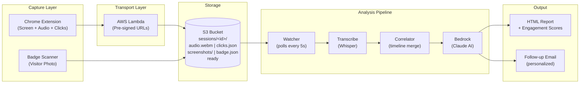

<!-- BoothApp README -->


```
 ____              _   _        _
| __ )  ___   ___ | |_| |__    / \   _ __  _ __
|  _ \ / _ \ / _ \| __| '_ \  / _ \ | '_ \| '_ \
| |_) | (_) | (_) | |_| | | |/ ___ \| |_) | |_) |
|____/ \___/ \___/ \__|_| |_/_/   \_\ .__/| .__/
                                     |_|   |_|
```

### AI-Powered Trade Show Demo Capture

> *Turn every booth conversation into actionable intelligence.*

BoothApp captures the full context of every trade show demo -- screen activity, audio, and visitor badge -- then uses AI to generate structured reports with engagement scores, topic detection, and personalized follow-up emails. Sales reps run dozens of demos per day and forget most of what happened. BoothApp remembers everything, correlates it into a timeline, and delivers a ready-to-send follow-up within minutes of the conversation ending.

---

## Architecture



---

## Components

| Component | Path | Status | Description |
|-----------|------|--------|-------------|
| Chrome Extension | `extension/` |  | Manifest V3 extension for screen, audio, and click capture |
| Pre-sign Lambda | `infra/presign-lambda/` |  | Generates pre-signed S3 upload URLs via API Gateway |
| S3 Watcher | `analysis/watcher.js` |  | Polls S3 for completed sessions and triggers pipeline |
| Correlator | `analysis/lib/correlator.js` |  | Merges clicks, transcript, and screenshots into a timeline |
| Report Generator | `analysis/engines/report_template.py` |  | Branded HTML report with engagement scores and topic breakdown |
| Email Generator | `analysis/lib/email-template.js` |  | Personalized follow-up emails with topic-specific content |
| Error Handling | `analysis/lib/errors.js` |  | Transient vs. permanent failure classification with retry |
| Demo Landing Page | `presenter/demo.html` |  | Trade show booth display with particle effects |
| Stats Dashboard | `presenter/stats.html` |  | Live demo statistics for booth screens |
| Health Dashboard | `infra/health.html` |  | Pipeline monitoring page |
| Preflight Check | `scripts/preflight.sh` |  | 9-point automated system check before demo day |

---

## Key Features

- **Real-time screen + audio capture** via Chrome Extension (Manifest V3)
- **Pre-signed S3 uploads** -- no credentials on the client, Lambda handles auth
- **2-second correlation window** -- clicks, transcript segments, and screenshots merged into a unified timeline
- **Product topic detection** -- regex-based identification of XDR, Endpoint Security, ZTSA, Cloud Security, and Email Security mentions
- **Engagement scoring** -- quantified visitor interest per topic
- **AI-powered analysis** -- Amazon Bedrock (Claude) generates insights and next steps
- **Personalized follow-up emails** -- auto-generated templates with topic-specific content, CTAs, and resource links
- **Health dashboard** -- HTML monitoring page for pipeline status
- **Demo-day preflight** -- 9-point automated system check before showtime
- **Structured error handling** -- transient vs. permanent failure classification with exponential backoff retry

---

## S3 Data Contract

Each session is stored under a unique session ID:

```
s3://boothapp-sessions-<account>/sessions/<session-id>/
  |
  |-- audio.webm              # WebM audio recording (MediaRecorder API)
  |-- clicks.json             # Array of click events:
  |                           #   [{ timestamp: <ms>, url: <string>,
  |                           #      element: <string>, x: <n>, y: <n> }]
  |-- screenshots/
  |   |-- click-001.jpg       # Frame captures matched to click events
  |   |-- click-002.jpg       #   (filename = click-<NNN>.jpg)
  |   +-- ...
  |-- badge.json              # Visitor badge data:
  |                           #   { name, company, title, email }
  |-- ready                   # Empty trigger file -- signals session complete
  |
  +-- output/                 # Written by analysis pipeline:
      |-- result.json         # Full analysis output
      |-- report.html         # Human-readable HTML report
      |-- follow-up-email.html# Personalized follow-up template
      +-- error.json          # On failure: { type, stage, message, retryable }
```

**Contract rules:**
- `ready` file must be the **last** file written -- the watcher uses it as a trigger
- `clicks.json` timestamps are epoch milliseconds, matching `audio.webm` timeline
- Screenshots are JPEG, named `click-NNN.jpg`, correlated by 2-second window
- `output/` directory is created by the pipeline -- never pre-create it
- `error.json` and `result.json` are mutually exclusive -- presence of either marks the session as processed

---

## Quick Start

### Prerequisites

| Tool | Version | Purpose |
|------|---------|---------|
| Node.js | 20.x | Analysis pipeline, watcher, tests |
| Python | 3.10+ | Report generation |
| AWS CLI | 2.x | S3 and Lambda access |
| AWS SAM CLI | 1.x | Lambda deployment |
| Chrome | Latest | Extension host |

### 1. Clone and Install

```bash
git clone https://github.com/grobomo/boothapp.git
cd boothapp
npm install
```

### 2. Load the Chrome Extension

1. Navigate to `chrome://extensions`
2. Enable **Developer mode** (toggle in top-right)
3. Click **Load unpacked**
4. Select the `extension/` directory

The extension captures screen activity via `chrome.tabCapture`, audio via `MediaRecorder API`, and click events via content script injection.

### 3. Deploy the Pre-sign Lambda

```bash
cd infra/presign-lambda
sam build
sam deploy --guided --profile hackathon
# Note the API Gateway endpoint URL from the output
```

### 4. Start the Analysis Pipeline

```bash
export AWS_PROFILE=hackathon
export AWS_REGION=us-east-1
export BOOTH_S3_BUCKET=boothapp-sessions-<your-account-id>

# Preflight check (recommended before demo day)
bash scripts/preflight.sh

# Start the watcher
npm run watcher
```

The watcher polls S3 every 5 seconds for sessions with a `ready` trigger file, runs the three-stage pipeline (transcribe -> correlate -> analyze), and writes the HTML report + follow-up email to the session's `output/` directory.

---

## Running the Demo

### Option A: Live Demo (Full Stack)

1. Load the Chrome extension and start the watcher (see Quick Start above)
2. Open a product page in Chrome -- the extension begins capturing
3. Walk through a demo conversation -- screen, audio, and clicks are recorded
4. Scan the visitor's badge (or manually create `badge.json`)
5. End the session -- the extension writes the `ready` trigger file
6. The watcher picks up the session and generates a report in `output/`

### Option B: Sample Data Demo (No AWS Required)

```bash
# Generate sample session data
python examples/generate_sample.py

# Open the demo landing page
open presenter/demo.html          # macOS
xdg-open presenter/demo.html     # Linux
start presenter/demo.html        # Windows

# Open the stats dashboard
open presenter/stats.html
```

### Option C: Run the Test Suite

```bash
npm test
```

103 tests across three suites:

| Suite | Count | Covers |
|-------|-------|--------|
| `correlator.test.js` | 31 | Timeline merge, topic detection, scoring |
| `errors.test.js` | 32 | Error classification, retry logic, backoff |
| `email-template.test.js` | 40 | Follow-up email generation, personalization |

---

## Project Structure

```
boothapp/
|-- analysis/
|   |-- engines/
|   |   +-- report_template.py     # HTML report generator (V1 branding)
|   |-- lib/
|   |   |-- correlator.js          # Click/transcript/screenshot merger
|   |   |-- email-template.js      # Follow-up email generator
|   |   |-- errors.js              # Error classification + retry logic
|   |   +-- error-writer.js        # Structured error JSON output
|   +-- watcher.js                 # S3 poller + pipeline orchestrator
|-- examples/
|   |-- generate_sample.py         # Sample data generator
|   +-- sample_data.json           # Example session data
|-- presenter/
|   |-- demo.html                  # Trade show booth landing page
|   +-- stats.html                 # Live demo statistics dashboard
|-- tests/                         # Test suites (103 tests)
|-- infra/
|   |-- presign-lambda/
|   |   |-- index.js               # Lambda handler (pre-signed S3 URLs)
|   |   +-- template.yaml          # SAM/CloudFormation template
|   +-- health.html                # Pipeline health dashboard
|-- scripts/
|   +-- preflight.sh               # 9-point demo-day system check
+-- package.json
```

---

## Tech Stack

| Layer | Technology | Purpose |
|-------|-----------|---------|
| Capture | Chrome Extension (MV3) | Screen, audio, click recording |
| Upload | AWS Lambda + API Gateway | Pre-signed S3 URL generation |
| Storage | Amazon S3 | Session data persistence |
| Transcription | Amazon Transcribe / Whisper | Audio to text |
| Correlation | Node.js (correlator.js) | Timeline merge + topic detection |
| Analysis | Amazon Bedrock (Claude) | AI insights + recommendations |
| Reports | Python (report_template.py) | Branded HTML report generation |
| Email | Node.js (email-template.js) | Personalized follow-up generation |
| Infra | AWS SAM + CloudFormation | Infrastructure as code |
| Testing | Node.js built-in test runner | Zero-dependency test suite |

---

## Team: Smells Like Machine Learning

```
  +-----------------------------------------------+
  |         SMELLS LIKE MACHINE LEARNING           |
  |              Hackathon 2026                    |
  +-----------------------------------------------+
  |                                                |
  |   Casey Mondoux ............ Team Lead         |
  |   Joel Ginsberg ............ Backend + Infra   |
  |   Tom Gamull ............... Analysis Pipeline  |
  |   Kush Mangat .............. Chrome Extension   |
  |   Chris LaFleur ............ Frontend + Reports |
  |                                                |
  +-----------------------------------------------+
```

---

*Built with caffeine and Claude at Hackathon 2026.*
